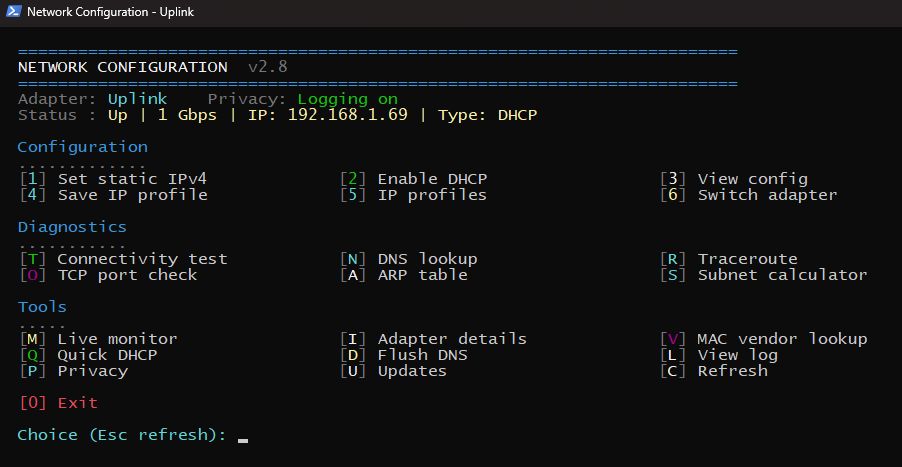

# Network Configuration Menu Script


## Description
A powerful PowerShell 5.1-compatible script for managing IPv4 network settings with GDPR-aware privacy controls. Features static IP/DHCP configuration, **modern IP profiles**, real-time network monitoring, diagnostics, subnet tools, **MAC vendor lookup**, managed backups, and log retention.

**Version**: 2.7
**Status**: Production Ready

## Key Features

### Network Management
- **Live Interface Monitoring** : Real-time event tracking with interactive controls
  - Cable plug/unplug detection with link status
  - IP acquisition, loss, and configuration changes
  - Gateway and DNS server monitoring
  - DHCP/Static configuration transitions
  - WiFi connection and signal strength tracking
  - On-demand diagnostics (D), status (S), clear log (C)
  - Dynamic window title with live stats
- **MAC Vendor Lookup**: Identify device manufacturers from MAC addresses
  - Online API integration with local caching
  - Supports multiple MAC formats (colons, dashes, or no separators)
  - Automatic retry for offline scenarios
  - Displays vendor info in IP configuration view
  - Interactive lookup tool (Option V)
- **Advanced IP Conflict Detection**: Multi-layered scanning (6 methods)
  - NetBIOS name query (catches Windows devices)
  - Gratuitous ARP with cache clear
  - ICMP ping verification
  - PowerShell ARP cache analysis
  - TCP port scan (SMB ports 445, 139)
  - Final comprehensive ARP check
- **Static IP & DHCP**: Switch between static and DHCP configurations
  - Automatic cleanup of residual IP addresses (prevents APIPA accumulation)
  - Post-configuration verification
- **IP Profiles**: Save and apply reusable JSON profiles with names, groups, adapter metadata, gateway/DNS settings, and legacy XML fallback
- **Diagnostics**: Connectivity test, DNS lookup, traceroute, TCP port check, ARP table, and subnet calculator
- **Subnet Calculator**: CIDR calculations, binary representations, subnetting guides, and safer blank/invalid input handling
- **Interface Management**: Rename and manage multiple network adapters

### GDPR Privacy & Compliance
- **User Consent Management**: Explicit opt-in for logging
- **IP Pseudonymization**: Automatic masking (192.168.1.xxx)
- **User Rights**: Access, logs-only deletion, full local-data deletion, consent changes, and data portability
- **Local Storage Only**: No external data transmission
- **Privacy Dashboard**: Dedicated menu for privacy controls
- **Retention Controls**: Log rotation plus age/count cleanup for logs and managed backups

### User Experience
- **Intuitive Menu**: Grouped configuration, diagnostics, and tools sections with single-key actions
- **Smart Validation**: IP, subnet, DNS, and hostname validation
- **Consistent Prompts**: `y/yes/n/no` confirmation handling across common workflows
- **Auto Version Sync**: Version tracking from script header
- **AppData Storage**: Organized file management in `%APPDATA%`
- **Pure ASCII**: Maximum compatibility across systems
- **PSScriptAnalyzer Clean**: Zero code quality issues

## Quick Actions
- `v` - MAC vendor lookup (identify device manufacturers)
- `q` - Quick DHCP configuration
- `t` - Quick network connectivity test
- `n` - DNS lookup
- `r` - Traceroute
- `o` - TCP port check
- `a` - ARP table
- `c` - Refresh menu
- `d` - DNS cache flush
- `i` - Adapter details (MAC, speed, status)

## Live Network Monitoring (Option 12)

Monitor your network interface in real-time with comprehensive event tracking:

### Features
- **Event Detection**: Cable connections, IP changes, DHCP/Static transitions, Gateway/DNS updates, WiFi network switching
- **Smart DHCP Tracking**: Time-based DHCP renewal detection (prevents false positives)
- **Activity Heartbeat**: Shows monitoring status during idle periods (every 60 seconds)
- **Interactive Controls**:
  - `D` - Run network diagnostics (Gateway, DNS, Internet)
  - `S` - Show current interface status
  - `C` - Clear event log
  - `Q/Esc` - Exit monitoring
- **Live Window Title**: Real-time status updates showing interface state, IP, config type, and event count
- **Color-Coded Events**: Green (acquired), Red (lost), Yellow (changed), Cyan (updated)
- **WiFi Support**: SSID display, signal strength, network switching detection
- **Detailed Diagnostics**: Ping tests with min/max/avg latency and packet loss percentages
- **Complete Logging**: All events logged with GDPR-compliant IP pseudonymization

### Example Events
```
[14:23:15] NETWORK DISCONNECTED - No link detected
[14:23:15] IP ADDRESS LOST - Was 192.168.1.xxx
[14:23:15] GATEWAY LOST - Was 192.168.1.1
[14:23:15] DNS SERVERS CLEARED - Was 1.1.1.1, 1.0.0.1
[14:23:15] LINK SPEED CHANGED: 1.0 Gbps -> 100 Mbps
[14:23:22] NETWORK CONNECTED - Link established
[14:23:22] DHCP REQUEST - Requesting IP address...
[14:23:22] IP ADDRESS ACQUIRED: 10.0.0.xxx
[14:23:22] DHCP: Acquired from 10.0.0.1
[14:23:22] DHCP LEASE: Expires Friday, 2 December 2025 14:23:20
[14:23:22] GATEWAY ACQUIRED: 10.0.0.1
[14:23:22] DNS SERVERS CONFIGURED: 8.8.8.8, 8.8.4.4
  [Monitoring active - No events for 1 minute]
```

## GDPR Compliance

- **Data Collected**: Interface names, log IP addresses (pseudonymized), saved profiles/backups, configuration settings, timestamps
- **Legal Basis**: Explicit user consent (GDPR Article 6(1)(a))
- **Storage**: Local only (`%APPDATA%\Network_Configuration_Script`)
- **User Rights**: Full GDPR compliance with access, erasure, rectification, portability

## Prerequisites
- Windows OS with PowerShell 5.1+
- Administrator privileges
- Script execution policy:
  ```powershell
  Set-ExecutionPolicy -Scope CurrentUser -ExecutionPolicy RemoteSigned
  ```

## Usage

1. **Download**: Get `Network_Configuration.ps1` from [releases](https://github.com/Dantdmnl/Network_Configuration_Script/releases)
2. **Run**: Right-click → Run with PowerShell (as Administrator)
3. **First Run**: Accept GDPR consent banner
4. **Configure**: Follow interactive prompts

## Changelog

### Version 2.7 (June 2026)
**Release Readiness, UX & Stability**
- ✅ Bumped script requirement to PowerShell 5.1 and hardened compatibility-sensitive paths
- ✅ Reworked main menu into grouped Configuration, Diagnostics, and Tools sections
- ✅ Added modern JSON IP profiles with groups, descriptions, adapter metadata, and legacy XML fallback
- ✅ Added DNS lookup, traceroute, TCP port check, and ARP table tools
- ✅ Improved subnet calculator input handling so blank/invalid input cancels cleanly
- ✅ Reduced confusing DNS apply warnings; reachability checks are now quiet diagnostics unless action is needed
- ✅ Added consistent `y/yes/n/no` confirmation prompts
- ✅ Added managed log rotation with age/count retention
- ✅ Added managed backup folder with capped update and network configuration backups
- ✅ Improved GDPR/privacy menu with logs-only deletion, full local-data deletion, and clearer export wording
- ✅ Fixed JSON log escaping and PSScriptAnalyzer `$profile` automatic-variable warnings

### Version 2.6 (January 2026)
**New Features & Major Enhancements**
- ✅ **MAC Vendor Lookup**: New interactive tool to identify device manufacturers
  - Online API integration (macvendors.com) with 2-second timeout
  - Smart caching system (successful lookups only, retries on failure)
  - Comprehensive input validation (supports all MAC formats)
  - Automatic display in IP configuration view (Option 3)
  - Dedicated lookup tool (Option V) with retry logic (3 attempts)
  - Graceful offline handling (retries when connection restored)
- ✅ **Advanced IP Conflict Detection**: Complete rewrite with 6 detection methods
  - NetBIOS name query (nbtstat) - catches Windows clients
  - Gratuitous ARP with cache clearing (arp -d + arp -a)
  - ICMP ping verification (1 count, fast)
  - PowerShell ARP cache analysis (Get-NetNeighbor)
  - TCP port scanning (SMB ports 445, 139)
  - Final comprehensive ARP verification
  - Compact single-line progress display: `Scanning: [NBT] [ARP] [PING] [CACHE] [TCP] [FINAL]`
  - ~1-2 second scan time (optimized from 3-4+ seconds)
- ✅ **Multiple IP Address Cleanup**: Prevents APIPA address accumulation
  - Post-DHCP cleanup removes all non-DHCP IPs (including APIPA 169.254.*)
  - Post-Static cleanup removes all IPs except configured one
  - Individual IP removal with proper delays (500ms)
  - Fixed display to show only primary non-APIPA address
- ✅ **Performance Optimizations**:
  - NetBIOS timeout reduced (2s → 1s) with background job
  - Conflict detection delays reduced (200ms → 100ms)
  - Ping count reduced (2 → 1)
  - TCP ports reduced (3 → 2, only essential SMB ports)
- ✅ **UI/UX Improvements**:
  - Added Read-Host pauses to Options 4, 5, L, D
  - Single-line compact progress indicators
  - Yellow warning messages (more visible than red)
  - Fixed double bracket display issue in success messages
  - Improved message clarity throughout
- ✅ **Code Quality**:
  - Removed duplicate IP conflict check (was running 2x)
  - Fixed PSScriptAnalyzer alias warning (foreach → .ToUpper())
  - Centralized version management ($script:ScriptVersion)
  - Fixed return value printing issue (return vs return $false)
  - PowerShell 5.1 compatibility (Test-Connection -ComputerName vs -TargetName)

**Bug Fixes**
- Fixed MAC vendor lookup caching failures (no longer caches "Lookup Failed")
- Fixed IP conflict detection not catching Windows clients (NetBIOS now works)
- Fixed multiple IP addresses displaying incorrectly in Show-IPInfo
- Fixed APIPA addresses (169.254.*) persisting after configuration changes
- Fixed status bar showing concatenated IPs instead of primary only

### Version 2.5 (January 2026)
**Critical Stability & Robustness Improvements**
- ✅ **Fixed PolicyStore DHCP conflict**: Resolved "Inconsistent parameters PolicyStore PersistentStore and Dhcp Enabled" error
- ✅ **Pre-flight validation**: Added comprehensive parameter validation (IP format, DNS format, gateway format, null checks)
- ✅ **Gateway subnet validation**: Critical check ensures gateway is in same subnet as IP address (prevents invalid configurations)
- ✅ **Smart gateway suggestions**: Subnet-aware suggestions for all prefix lengths (e.g., /22 suggests 172.16.48.1 and 172.16.51.254)
- ✅ **Robust DHCP disable**: Retry mechanism with verification (up to 3 attempts) before applying static IP
- ✅ **Configuration backup & rollback**: Automatic rollback to DHCP if static IP configuration fails
- ✅ **Retry mechanisms**: Configurable retries for IP configuration (2x) and DNS setup (2x) with intelligent delays
- ✅ **State verification**: Validates DHCP status, IP address, gateway, and DNS after each critical step
- ✅ **Final state verification**: Comprehensive verification of all parameters with detailed reporting
- ✅ **DNS cache clearing**: Automatic DNS cache flush for immediate effect
- ✅ **Adapter status check**: Warns if adapter is not "Up" before configuration
- ✅ **Enhanced logging**: Granular DEBUG, INFO, WARN, ERROR, and CRITICAL level logging throughout
- ✅ **Better error messages**: Specific error reporting for each failure point with suggested actions

**Enterprise-Grade Reliability**: The Set-StaticIP function is now production-ready with extensive error handling, automatic recovery, and fail-safe mechanisms.

### Version 2.4 (January 2026)
**Major Improvements**
- ✅ Enhanced IP conflict detection with ARP lookup fallback (more reliable on networks where ICMP is blocked)
- ✅ Added smart conflict detection that only warns when on the same subnet (prevents false positives when switching networks)
- ✅ Improved status line showing interface state, link speed, IP, and config type at a glance
- ✅ Added validation to prevent setting IP to gateway address, network address (.0), or broadcast address (.255)
- ✅ Added warning for suspicious .1 IP configurations
- ✅ Optimized conflict check timeout to 2 seconds for faster configuration
- ✅ Enhanced menu with colored option numbers for better visual hierarchy
- ✅ Fixed console colors for better visibility (black background support)
- ✅ Improved DHCP disable workflow for static IP configuration reliability
- ✅ All PSScriptAnalyzer warnings resolved (production-grade code quality)

### Version 2.3 (December 2025)
**Live Monitoring Enhancements**
- ✅ Fixed false DHCP renewal events (smart time-based detection with >1 minute threshold)
- ✅ Added activity heartbeat indicator (shows "No events for X minutes" after 60s idle)
- ✅ Improved WiFi network switching detection and messaging
- ✅ Added MAC address display in status view
- ✅ Enhanced DHCP lease time calculations with better date parsing
- ✅ Fixed duplicate timestamp display bug
- ✅ Fixed window title reset issue after monitoring exit
- ✅ Standardized all timestamp colors to gray for consistency
- ✅ Added comprehensive event logging with GDPR pseudonymization
- ✅ Fixed all PSScriptAnalyzer warnings (production-ready code quality)

**Bug Fixes**
- Fixed WiFi status variable reference ($curr.WiFiSSID)
- Fixed hardcoded computer name in Test-Connection
- Added proper error handling to empty catch blocks
- Improved DHCP server change detection and logging

### Version 2.2
- Initial Live Interface Monitoring feature
- Real-time network event tracking
- Interactive diagnostics during monitoring
- GDPR-compliant logging system
