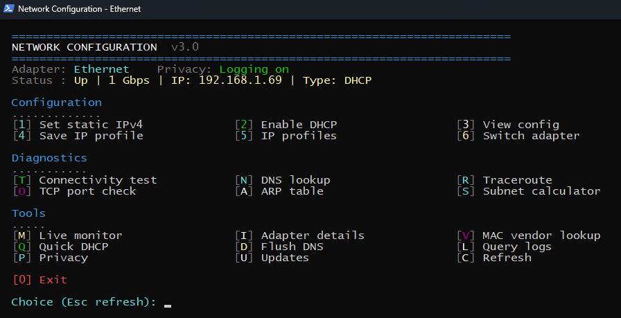

# Network Configuration Menu Script



## Description

A Windows PowerShell 5.1 script for managing IPv4 network settings with opt-in logging and IP masking. Features static IP/DHCP configuration, IP profiles, live network monitoring, diagnostics, subnet tools, MAC vendor lookup, managed backups, and log retention.

**Version**: 3.0 (unreleased)

Profile and manual static reapplication, static-to-DHCP, and DHCP-to-static have been confirmed by user testing on a Proxmox Windows VM. Reboot persistence and the remaining live release checks are tracked in [Debug/TESTING.md](Debug/TESTING.md).

## Key Features

### Network Management

- **Live Interface Monitoring**: Track link, IP, gateway, DNS, DHCP, and Wi-Fi changes; run diagnostics from the monitor.
- **MAC Vendor Lookup**: Query manufacturers using common MAC formats, cache successful results for the session, and retry failed lookups on a later request.
- **IP Conflict Detection**: Exact local ownership and neighbor checks on the selected interface
  - Bounded ping probe to populate the neighbor cache
  - Ignore unrelated adapters, similar IP strings, and incomplete neighbors
  - Wait for Windows duplicate-address detection; reject Duplicate and timed-out Tentative addresses
  - Treat negative pre-flight probes as advisory
- **Static IP & DHCP**: Switch between static and DHCP configurations
  - Automatic cleanup of residual IP addresses (prevents APIPA accumulation)
  - Post-configuration verification
  - Subnet-aware gateway suggestions and strict IPv4/subnet input validation
  - Configure addresses and gateway routes independently to avoid duplicate gateway creation
  - Reconcile active and persistent IPv4 default routes on the selected adapter
  - Attempt to restore prior static or DHCP settings on apply failure, including DNS mode and manual DNS overrides; report incomplete recovery
  - Create durable gateway routes without unsupported explicit PersistentStore creation and show gateway provider errors in the console
  - Verify IPv4 DNS values and order without changing IPv6 DNS
- **IP Profiles**: Save and apply reusable JSON profiles with names, groups, adapter metadata, gateway/DNS settings, and legacy XML fallback. Profile replacement requires confirmation.
- **Diagnostics**: Connectivity test, DNS lookup, traceroute, TCP port check, ARP table, and subnet calculator
- **Subnet Calculator**: CIDR calculations, binary representations, subnetting guides, and safer blank/invalid input handling
- **Interface Management**: Rename and manage multiple network adapters, including virtual NICs

### Privacy Controls

- **Logging Choice**: Explicit opt-in for logging; profiles and backups are created by user actions
- **Stored Data**: Interface names, timestamps, masked log IP addresses, and full settings in saved profiles/backups
- **Data Controls**: Access, logs-only deletion, full local-data deletion, consent changes, and export
- **Local Storage**: Logs, profiles, and backups stay in `%APPDATA%\Network_Configuration_Script`. MAC vendor lookup sends the first six MAC digits (the vendor prefix) to `api.macvendors.com`; update checks download the script from GitHub.
- **Privacy Dashboard**: Dedicated menu for privacy controls
- **Retention Controls**: Log rotation plus age/count cleanup for logs and managed backups
- **Log Viewer**: Search current and rotated JSON logs by message text, severity, and date; page through results in the console

### User Experience

- **Intuitive Menu**: Grouped configuration, diagnostics, and tools sections with single-key actions
- **Input Validation**: IPv4 addresses, subnet masks, and DNS server addresses
- **Consistent Prompts**: `y/yes/n/no` confirmation handling across common workflows
- **Auto Version Sync**: Version tracking from script header
- **Safer Updates**: Downloads are parsed and staged before replacement, with a managed backup of the previous script
- **PSScriptAnalyzer Clean**: Clean with the included project settings for this interactive console utility

## Quick Actions

- `v` - MAC vendor lookup (identify device manufacturers)
- `q` - Quick DHCP configuration
- `t` - Quick network connectivity test
- `n` - DNS lookup
- `r` - Traceroute
- `o` - TCP port check
- `a` - ARP table
- `c` - Refresh menu
- `d` - DNS cache flush
- `i` - Adapter details (MAC, speed, status)
- `l` - Query logs (recent entries, filters, and raw log access)
- `m` - Live network monitor
- `s` - Subnet calculator
- `p` - Privacy controls
- `u` - Check for updates

## Log Viewer

Press `l` in the main menu or choose **Query Logs** in the Privacy menu. The viewer searches the current log and retained rotated archives, shows newest entries first, and displays 20 results per page. Choose **Query** to filter by exact severity (`DEBUG`, `INFO`, `WARN`, `ERROR`, or `CRITICAL`), a case-insensitive literal message search, and an inclusive date range (`yyyy-MM-dd`). Results are capped at 200 by default; you can request up to 1,000. The raw current log can still be opened in Notepad.

Logging consent controls new entries. Previously saved logs remain viewable until deleted.

## Live Network Monitoring (M)

Press `m` to monitor the selected adapter. The console shows timestamped link, address, gateway, DNS, DHCP, and Wi-Fi changes, updates the window title, and displays an idle heartbeat every 60 seconds. Monitoring events follow your logging consent and IP masking settings.

While monitoring:

- `D` - Run gateway, DNS, and internet diagnostics
- `S` - Show current interface status
- `C` - Clear the displayed event log
- `Q/Esc` - Exit monitoring

## Prerequisites

- Windows with Windows PowerShell 5.1
- Administrator privileges
- Script execution policy

```powershell
Set-ExecutionPolicy -Scope CurrentUser -ExecutionPolicy RemoteSigned
```

## Hardware Compatibility

The script uses built-in Windows networking cmdlets and includes virtual adapters in selection. User testing confirms the main static/DHCP workflows on a Proxmox Windows VM; this does not establish compatibility with every NIC model, driver, or Windows build.

On configuration failure, check the displayed error and recovery result. Recovery is best effort: use the saved backup and local or VM console if it reports incomplete recovery. A configuration change can interrupt a remote session. Managed backups are stored under `%APPDATA%\Network_Configuration_Script\backups`.

## Usage

1. **Download**: Get `Network_Configuration.ps1` from [releases](https://github.com/Dantdmnl/Network_Configuration_Script/releases)
2. **Run**: Right-click -> Run with PowerShell. If needed, the script will request administrator elevation.
3. **First Run**: Choose whether to enable optional logging
4. **Configure**: Follow interactive prompts

## Testing

Run `powershell -NoProfile -ExecutionPolicy Bypass -File .\Debug\test_regression.ps1` for the complete isolated regression suite and static checks. See [Debug/TESTING.md](Debug/TESTING.md) for dependencies, coverage, reports, and live release validation.

The latest local Windows PowerShell 5.1 run passed all 11 suites, including 130 named Pester tests. Automated network tests use mocks and do not modify real adapters.

## Release history

See [CHANGELOG.md](CHANGELOG.md) for release history.
