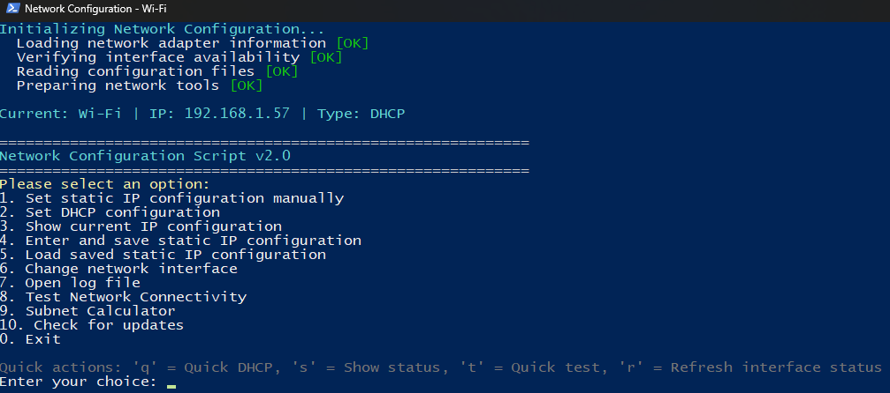

# Network Configuration Menu Script


## Description
A powerful PowerShell script for managing IPv4 network settings with GDPR-compliant privacy controls. Features static IP/DHCP configuration, **real-time network monitoring**, network diagnostics, subnet calculator, and comprehensive configuration management.

**Version**: 2.5  
**Status**: Production Ready

## Key Features

### Network Management
- **Live Interface Monitoring** : Real-time event tracking with interactive controls
  - Cable plug/unplug detection with link status
  - IP acquisition, loss, and configuration changes
  - Gateway and DNS server monitoring
  - DHCP/Static configuration transitions
  - WiFi connection and signal strength tracking
  - On-demand diagnostics (D), status (S), clear log (C)
  - Dynamic window title with live stats
- **Static IP & DHCP**: Switch between static and DHCP configurations
- **Configuration Save/Load**: Backup and restore network settings via XML
- **Network Testing**: Gateway, DNS, and internet connectivity diagnostics
- **Subnet Calculator**: CIDR calculations, binary representations, subnetting guides
- **Interface Management**: Rename and manage multiple network adapters

### GDPR Privacy & Compliance
- **User Consent Management**: Explicit opt-in for logging
- **IP Pseudonymization**: Automatic masking (192.168.1.xxx)
- **User Rights**: Access, Erasure, Rectification, Data Portability
- **Local Storage Only**: No external data transmission
- **Privacy Dashboard**: Dedicated menu for privacy controls (Option 11)

### User Experience
- **Intuitive Menu**: Easy navigation with quick actions ('q', 't', 'c', 'd', 'i')
- **Smart Validation**: IP, subnet, DNS, and hostname validation
- **Auto Version Sync**: Version tracking from script header
- **AppData Storage**: Organized file management in `%APPDATA%`
- **Pure ASCII**: Maximum compatibility across systems
- **PSScriptAnalyzer Clean**: Zero code quality issues

## Quick Actions
- `q` - Quick DHCP configuration
- `t` - Quick network connectivity test
- `c` - Clear screen
- `d` - DNS cache flush
- `i` - Interface information (MAC, speed, status)

## Live Network Monitoring (Option 12)

Monitor your network interface in real-time with comprehensive event tracking:

### Features
- **Event Detection**: Cable connections, IP changes, DHCP/Static transitions, Gateway/DNS updates, WiFi network switching
- **Smart DHCP Tracking**: Time-based DHCP renewal detection (prevents false positives)
- **Activity Heartbeat**: Shows monitoring status during idle periods (every 60 seconds)
- **Interactive Controls**:
  - `D` - Run network diagnostics (Gateway, DNS, Internet)
  - `S` - Show current interface status
  - `C` - Clear event log
  - `Q/Esc` - Exit monitoring
- **Live Window Title**: Real-time status updates showing interface state, IP, config type, and event count
- **Color-Coded Events**: Green (acquired), Red (lost), Yellow (changed), Cyan (updated)
- **WiFi Support**: SSID display, signal strength, network switching detection
- **Detailed Diagnostics**: Ping tests with min/max/avg latency and packet loss percentages
- **Complete Logging**: All events logged with GDPR-compliant IP pseudonymization

### Example Events
```
[14:23:15] NETWORK DISCONNECTED - No link detected
[14:23:15] IP ADDRESS LOST - Was 192.168.1.xxx
[14:23:15] GATEWAY LOST - Was 192.168.1.1
[14:23:15] DNS SERVERS CLEARED - Was 1.1.1.1, 1.0.0.1
[14:23:15] LINK SPEED CHANGED: 1.0 Gbps -> 100 Mbps
[14:23:22] NETWORK CONNECTED - Link established
[14:23:22] DHCP REQUEST - Requesting IP address...
[14:23:22] IP ADDRESS ACQUIRED: 10.0.0.xxx
[14:23:22] DHCP: Acquired from 10.0.0.1
[14:23:22] DHCP LEASE: Expires Friday, 2 December 2025 14:23:20
[14:23:22] GATEWAY ACQUIRED: 10.0.0.1
[14:23:22] DNS SERVERS CONFIGURED: 8.8.8.8, 8.8.4.4
  [Monitoring active - No events for 1 minute]
```

## GDPR Compliance

**Data Collected**: Interface names, IP addresses (pseudonymized), configuration settings, timestamps  
**Legal Basis**: Explicit user consent (GDPR Article 6(1)(a))  
**Storage**: Local only (`%APPDATA%\Network_Configuration_Script`)  
**User Rights**: Full GDPR compliance with access, erasure, rectification, portability

## Prerequisites
- Windows OS with PowerShell 5.1+
- Administrator privileges
- Script execution policy:
  ```powershell
  Set-ExecutionPolicy -Scope CurrentUser -ExecutionPolicy RemoteSigned
  ```

## Usage

1. **Download**: Get `Network_Configuration.ps1` from [releases](https://github.com/Dantdmnl/Network_Configuration_Script/releases)
2. **Run**: Right-click → Run with PowerShell (as Administrator)
3. **First Run**: Accept GDPR consent banner
4. **Configure**: Follow interactive prompts

## Changelog

### Version 2.5 (January 2026)
**Critical Stability & Robustness Improvements**
- ✅ **Fixed PolicyStore DHCP conflict**: Resolved "Inconsistent parameters PolicyStore PersistentStore and Dhcp Enabled" error
- ✅ **Pre-flight validation**: Added comprehensive parameter validation (IP format, DNS format, gateway format, null checks)
- ✅ **Gateway subnet validation**: Critical check ensures gateway is in same subnet as IP address (prevents invalid configurations)
- ✅ **Smart gateway suggestions**: Subnet-aware suggestions for all prefix lengths (e.g., /22 suggests 172.16.48.1 and 172.16.51.254)
- ✅ **Robust DHCP disable**: Retry mechanism with verification (up to 3 attempts) before applying static IP
- ✅ **Configuration backup & rollback**: Automatic rollback to DHCP if static IP configuration fails
- ✅ **Retry mechanisms**: Configurable retries for IP configuration (2x) and DNS setup (2x) with intelligent delays
- ✅ **State verification**: Validates DHCP status, IP address, gateway, and DNS after each critical step
- ✅ **Final state verification**: Comprehensive verification of all parameters with detailed reporting
- ✅ **DNS cache clearing**: Automatic DNS cache flush for immediate effect
- ✅ **Adapter status check**: Warns if adapter is not "Up" before configuration
- ✅ **Enhanced logging**: Granular DEBUG, INFO, WARN, ERROR, and CRITICAL level logging throughout
- ✅ **Better error messages**: Specific error reporting for each failure point with suggested actions

**Enterprise-Grade Reliability**: The Set-StaticIP function is now production-ready with extensive error handling, automatic recovery, and fail-safe mechanisms.

### Version 2.4 (January 2026)
**Major Improvements**
- ✅ Enhanced IP conflict detection with ARP lookup fallback (more reliable on networks where ICMP is blocked)
- ✅ Added smart conflict detection that only warns when on the same subnet (prevents false positives when switching networks)
- ✅ Improved status line showing interface state, link speed, IP, and config type at a glance
- ✅ Added validation to prevent setting IP to gateway address, network address (.0), or broadcast address (.255)
- ✅ Added warning for suspicious .1 IP configurations
- ✅ Optimized conflict check timeout to 2 seconds for faster configuration
- ✅ Enhanced menu with colored option numbers for better visual hierarchy
- ✅ Fixed console colors for better visibility (black background support)
- ✅ Improved DHCP disable workflow for static IP configuration reliability
- ✅ All PSScriptAnalyzer warnings resolved (production-grade code quality)

### Version 2.3 (December 2025)
**Live Monitoring Enhancements**
- ✅ Fixed false DHCP renewal events (smart time-based detection with >1 minute threshold)
- ✅ Added activity heartbeat indicator (shows "No events for X minutes" after 60s idle)
- ✅ Improved WiFi network switching detection and messaging
- ✅ Added MAC address display in status view
- ✅ Enhanced DHCP lease time calculations with better date parsing
- ✅ Fixed duplicate timestamp display bug
- ✅ Fixed window title reset issue after monitoring exit
- ✅ Standardized all timestamp colors to gray for consistency
- ✅ Added comprehensive event logging with GDPR pseudonymization
- ✅ Fixed all PSScriptAnalyzer warnings (production-ready code quality)

**Bug Fixes**
- Fixed WiFi status variable reference ($curr.WiFiSSID)
- Fixed hardcoded computer name in Test-Connection
- Added proper error handling to empty catch blocks
- Improved DHCP server change detection and logging

### Version 2.2
- Initial Live Interface Monitoring feature
- Real-time network event tracking
- Interactive diagnostics during monitoring
- GDPR-compliant logging system
